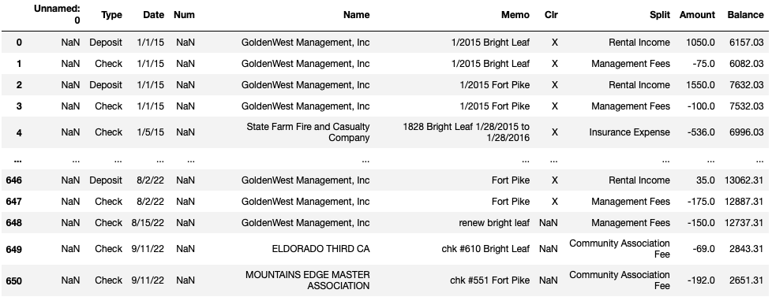
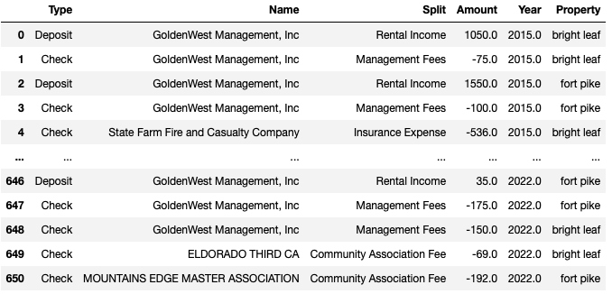

# Las Vegas Real Estate Portfolio Analysis

The main goal for investors is to grow their money over the long term. While the goal is to pick the best investments, there will always be some that out perform others. In this case, we have two properties located in Las Vegas, Nevada and are trying to see how they fare against each other. The main goal of this analysis is understand if high turnover leads to a better real estate investment.

### Facts:
#### Bright Leaf
 - Located in North Las Vegas
 - Purchase 1/2013
 - Purchase Price: 109k
 - Currently rented below market rent: $1,400
 - Assumed value: $395,900 - from Zillow
 - Rent raised between 3-5% each year
 - Only one move out but new tenant was old tenant's sister, so rent was not pushed to market rent
 
#### Fort Pike
 - Located in South West Las Vegas
 - Purchase 2/2013
 - Purchase Price: 187k
 - Currently rented at market rent: $2,149
 - Assumed value: $527,500 - from Zillow
 - Rent raised between 3-5% each year if tenant renewed
 - 5 move outs in the period of 2015-2022 and each time rent was listed for market rent

#### How does a move out affect profit?
 - When the home is relisted, it is pushed up to market rent
 - Each move out requires cleaning and repairing the home for a new tenant
 - More expenses incurr because the time it takes to repair home and get it rerented out takes about a month
 - Also have to pay administrative fees to property management to find new tenants
 - New tenants usually have a lot of maintenance request the first 6 months of tenancy because they find broken things that the old tenant lived with

### Overview of Data

<iframe src='./PCT-Growth.html' width=1000 height=600 frameBorder=0></iframe>

<iframe src='./Revenue.html' width=1000 height=600 frameBorder=0></iframe>

<iframe src='./Repairs and Maintenance Rev.html' width=1000 height=600 frameBorder=0></iframe>

<iframe src='./NOI.html' width=1000 height=600 frameBorder=0></iframe>

<iframe src='./CapRate.html' width=1000 height=600 frameBorder=0></iframe>

<iframe src='./COC.html' width=1000 height=600 frameBorder=0></iframe>
