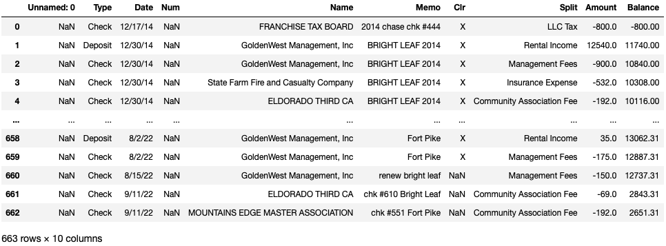

# Las Vegas Real Estate Portfolio Analysis

## Research Question: Is there a relationship between property turnover and profit from 2015-2021?

### Inspiration
The inspiration for the project originates from the dilemma of wanting the tenants to be happy and stay while wanting to make more money as a business. This is a hard choice for most and most landlords tend to choose one or the other causing them to loose on lots of money with low rents or faced with high expenses through high turnover. The goal of this analysis is to see if there is a relationship and to find an in between that would make tenants stay long while landlords still make more money.

### Facts:
#### House 1
 - Located in North Las Vegas
 - Currently rented below market rent: $1,400
 - Assumed value: $395,900 - from Zillow
 - Rent raised between 3-5% each year
 - 1 turn over in 2019 but new tenant was old tenant's sister, so rent was not pushed to market rent
 
#### House 2
 - Located in South West Las Vegas
 - Currently rented at market rent: $2,149
 - Assumed value: $527,500 - from Zillow
 - Rent raised between 3-5% each year if tenant renewed
 - 3 turn overs in the period of 2015-2022 and each time rent was listed for market rent (2018, 2020, 2021)

#### How does a move out affect profit?
 - When the home is relisted, it is pushed up to market rent giving more income
 - Each move out requires cleaning and repairing the home for a new tenant
 - More expenses incur because the time it takes to repair home and get it rerented out takes about a month
 - Have to pay administrative fees to property management to find new tenants
 - New tenants usually have a lot of maintenance request the first year of tenancy because they find minor broken/defective things that the old tenant lived with

### Overview of Data

The data consist of 663 transactions relating to this specific investment portfolio. Although most expenses are relating to a specific property, there are a few expenses that are a expense of the business such as the LLC tax. This data is exported from Quickbooks which provides accurate expenses for the properties and the business from December 2014 - September 2022. The data consist of 10 columns, while a few are unnecessary, it provides data of when the transaction occurred, if the transaction was an expense or income, where the money came from or is going, what the transaction is relating to, and how much was sent.

### Data Cleaning / Preprocessing

To get the data into a form that is useable to perform an analysis on, we must make sure the final form of the data specifies which property the transaction is relating to, what the transaction was for, the amount of the transaction, and the year the transaction occurred. We are able to get an idea of which transaction is related to which property by looking at the memo and labeling the transaction based off of the information given in the memo.

In the preprocessing step, I filtered the data to only inlcude transactions from 2015 - 2021 because it would allow 7 years of full data. I then removed maintenance expenses that were over 1k dollars because the property management defines these as not normal maintenance jobs. I also removed maintenance expenses that were reimbursed. In this case, there was one transaction over 1k and 2 transaction were reimbursed, so in total, I removed 3 transactions. The reason that I removed the not normal maintenance jobs was because they were likely capital expenditures(capex) that have a certain lifespan that is known from the begining.

### Visualization - Annual Revenue from 2015 - 2021

The annual revenue is generated from renting the home to tenants through a one-year period. Since the leases do not start and end at the begining and end of the year, there is a rent increase at the new lease or renew of a lease sometime mid-year.

<iframe src='./visuals/Revenue.html' width=1000 height=600 frameBorder=0></iframe>

House 2 has outperformed House 1 in consistently providing a higher revenue. A higher revenue is good because it gives more room to remain profitable even when there are more expenses relating to maintenance. Although the revenue of House 2 looks good, we are not sure how the high turnover rate will affect the profit because we hypothesize that there are more repairs and maintenance request done when there is a turnover.

### Visualization - Repair Cost Distribution from 2015 - 2021

To get a better understanding of the maintenance cost of the properties, we should look at the distribution of the cost. In a normal world, we would expect the cost to be normally distributed with a few outlier points to show the regular maintenance of a home and the few bigger expenses that sometimes happens when owning a home.

<iframe src='./visuals/repair_dist.html' width=1000 height=600 frameBorder=0></iframe>

We can see what we expected to happen fits with how the House 1 repair cost is distributed. The House 2 repair cost distribution is positively skewed which means that there are frequent smaller expenses and also fewer larger expenses, but the larger expenses are much larger. This makes sense with high turnover because a lot of small things need to be fixed when a tenant moves out because most people are able to ignore small maintenance items when they have been living there, but it is different than someone who is not used to living in the place yet and can see all the small defects. The larger expenses also being larger make sense for high turnover because there will be heavy wear and tear on appliances with different tenants being much harsher on them than others.

### Visualization - Number of Maintenance Request from 2015 - 2021

The number of maintenance request on turnover years will help give us an idea of how profit will be affected. We would expect the more maintenance request, the more expenses, thus leading to lower profit.

<iframe src='./visuals/number of maintenance request.html' width=1000 height=600 frameBorder=0></iframe>

What we see from this is that the turnover years for the House 2 property does have a higher number of maintenance request. We can especially see this in 2021 because this was a back to back turnover year where a first year tenant moved out and a new tenant moved in. While the 2018 turnover year has more maintenance request than 2015, 2017, and 2019, it has the same amount of maintenance request as the non-turnover year of 2016. To see if the turnover had an effect on maintence expense for the 2018 year, we should compare the cost of maintenance of 2016 vs 2018 to get a better look. The House 1 property stayed relatively consistent with maintenance request sticking between 1 and 3 a year.

### Visualization - Cost of Maintenance Request per Year from 2015 - 2021

Looking at the number of maintenance request doesn't tell the full story, but it does show a trend of what is happening on certain years. To see how profit is affected, we need to know how much expenses occur from maintenance.

<iframe src='./visuals/maintenance cost by year.html' width=1000 height=600 frameBorder=0></iframe>

To continue on from the last visualization we can see that 2018 has a much higher maintenance expense than 2016 even though they had the same number of maintenance request. We can also see that the cost for 2020 and 2021 were also much higher than all the non-turnover years and they were also much higher. This is very apparent in the peak in one year and a decrease the year after. Since 2021 was another turnover year after the 2020 turnover for House 2, the cost did not decrease, it instead increased even more because 2021 consisted of both a first year tenant for the first part of the year and a new tenant for the other part of the year. The House 1 property stayed relatively flat with the different years fluctuating between $85 - $1040.

### Visualization - Repairs and Maintenance Compared to Revenue from 2015 - 2021

Repairs and Maintenance is important because these are expenses that need to be paid and take away from the profit at the end of the year. If this is not accounted for, it can hide how a property is actually performing.

<iframe src='./visuals/Repairs and Maintenance Rev.html' width=1000 height=600 frameBorder=0></iframe>

We can see that for most years, House 1 has a relatively low dollar amount of maintenance request. House 2 has the highest maintenance dollar amount on years where turnover happens. We can see in 2018 it is high but the year after is low. We can also see that turnover causes a higher $ amount of maintenance request in 2021 because that was the year when a tenant who was living there on their first year moved out and a new tenant moved in. The highest amount of maintenance request tend to be in the first year that a renter has lived there. 

### Visualization - Net Operating Income from 2015 - 2021

Net operating income (NOI) is an important metric because it factors in expenses which is a big part of maintaining a property. NOI is an important indicator of profitability and accounts for other factors such as turnover that revenue can not account for.

<iframe src='./visuals/NOI.html' width=1000 height=600 frameBorder=0></iframe>

While House 2 consistently had a higher revenue, we can see that the NOI declined a big amount on the years that turnover ocurred. In 2018 and 2020, we can see that the NOI was much closer as compared to when there was no turnover in 2015, 2016, 2017, and 2019. In 2021, we can even see that House 1 had a higher NOI than House 2 even though House 2 has a higher annual revenue.

### Visualization - Cap Rate from 2015 - 2021

<!-- Capitalization rate is an important metric because it describes the risk of a property. The lower cap rates tend to mean a lower risk investment, but it comes with not as high returns because it is a more desireable area with higher home values. While the home values grow higher, rent follows but at a slower pace because renters tend to be more limited in income compared to someone buying a home in the area. The higher cap rates correspond to a higher risk investment, but the higher risk comes with higher return. Like all investments, this follows the principles of "high risk, high reward." -->

The reason why I chose to compare the cap rate with operating expenses and without is because the House 2 property has higher turnover which means that it has more maintenance request. Looking at the cap rate without operating expenses provides a better idea of how the property compares when there is not high turnover in the House 2 property.

<iframe src='./visuals/CapRate.html' width=1000 height=600 frameBorder=0></iframe>

As we can see from the visual, House 1 tends to do better when accounting for operating expenses, but is more comparable to each other when only looking at revenue. This shows that a high turnover rate hurts investment properties potential because the higher expenses incurred from each turnover. We can especially see this when looking at 2018, 2020, and 2021 specifically because when looking at cap rate with no expenses, House 1 and House 2 are comparable in 2018 and 2021 while House 2 outperforms in 2020. We can see when accounting for expenses that House 1 outperformed House 2 in those 3 years.

### Takeaways
 - High turnover leads to more $ amount spent on maintenance leading to less profit
 - Best to raise rent closer to market value at renewal while still staying below to give the tenant an incentive to stay
     - This allows us to bring in more revenue while not having the turnover eat up a lot of the extra revenue gained from the higher amount of maintenance request
 - Having back to back turnover will cost more than keeping the rent lower and having the tenant stay longer.

### Conclusion

From the analysis, we have reason to believe that property turnover does affect profit. My goal for this analysis was to understand the best way to maximize revenue while minimizing the amount of maintenance request. The two factors that directly affect that is the rent charged and turnover. By having rent too high at renewal, it can cause the tenants to leave and a turnover to occur. With each turnover, there are many expenses that come with it on both the administrative and maintenance side. Turnover contributes to a high amount of maintenance request for the first year that the tenants live in the home and there are fees charged to find a new tenants for the home. The best way to bypass the turnover to save on the maintenance and administrative expenses is by keeping the rent close to market rent but below enough where it gives the tenant an incentive to stay. This is a win-win for both sides because the turnover will eat up a large amount of the rent gained of being able to rerent at market rent.

### Dashboard
<iframe seamless frameborder="0" src="https://public.tableau.com/views/LV_Real_Estate/Dashboard1?:embed=yes&:display_count=yes&:showVizHome=no" width = '1100' height = '850' scrolling='yes' ></iframe>

